# Hướng dẫn cài đặt và sử dụng AppBI Pipeline

Tài liệu dành cho người cài đặt, người vận hành và người sử dụng AppBI Pipeline. Thực hiện theo thứ tự: chuẩn bị máy, lấy source, khởi chạy, kiểm tra, tạo Nguồn và Đích, tạo Pipeline, chạy thử, sau đó mới bật lịch tự động.

Phiên bản đối chiếu: source `3937ef9` trên nhánh `master`. Ngày biên soạn: **08 tháng 10 năm 2026**, múi giờ UTC+7. Lệnh Windows trong tài liệu dùng **PowerShell**, chạy tại thư mục gốc repository, trừ khi có chỉ dẫn khác.
## 1 Bắt đầu nhanh

### Máy hiện tại

Source nằm tại `D:\Appv2\appbi-pipeline`. Cấu hình cục bộ đã có trong `.env`; không chép đè bằng `.env.example`.

```powershell
Set-Location D:\Appv2\appbi-pipeline
git status --short --branch
git fetch origin
git log --oneline HEAD..origin/master
git pull --ff-only origin master
powershell -NoProfile -ExecutionPolicy Bypass -File .\run.ps1
```

Chạy từng lệnh; nếu một lệnh báo lỗi thì xử lý trước khi chạy lệnh tiếp theo. `git log` không in commit nghĩa là không có commit mới trên `origin/master` so với HEAD. Chỉ dùng chuỗi trên khi đang ở `master` và đã xử lý thay đổi cục bộ theo mục 4.

| Địa chỉ trên máy đã kiểm tra | Mục đích |
|---|---|
| http://localhost:8080 | Giao diện chính qua nginx |
| http://localhost:8080/readyz?deep=1 | Kiểm tra API và engine |
| http://localhost:8080/docs | Tài liệu API tương tác |
| http://localhost:8011 | API trực tiếp phục vụ chẩn đoán |
| http://localhost:3100 | Frontend trực tiếp |
| 127.0.0.1:15433 | PostgreSQL từ máy chủ; đã đổi vì Windows dành riêng dải cổng chứa 55433 |

**Đăng nhập local/demo mặc định:** email `admin@appbi.local`, mật khẩu `AppBI@123456`. `run.sh` và `run.ps1` tự điền hai giá trị này vào `.env` khi trường tương ứng còn trống; giao diện không nhúng thông tin đăng nhập. Có thể đổi `SEED_ADMIN_EMAIL` và `SEED_ADMIN_PASSWORD` trong `.env`, rồi chạy lại script để cập nhật tài khoản trong cơ sở dữ liệu. Không đưa file `.env`, mật khẩu hoặc khóa mã hóa vào tài liệu chia sẻ.

### Máy mới

```powershell
git clone https://github.com/QuangChinhDE/appbi-pipeline.git
Set-Location appbi-pipeline
powershell -NoProfile -ExecutionPolicy Bypass -File .\run.ps1
```

Chỉ chạy sau khi Git và Docker Desktop đã sẵn sàng. Mở URL mà script in ra. Bản `.env.example` hiện tại dùng API **8010**, còn máy đã kiểm tra dùng **8011**; giao diện chính đều là **8080** nếu chưa đổi cấu hình.

## 2 Hiểu các thành phần trước khi cài

Pipeline đưa dữ liệu từ hệ thống nguồn về kho đích. Transform dùng dự án dbt để biến dữ liệu đã có trong kho thành bảng phục vụ báo cáo. Một Pipeline có nhiều lần chạy; mỗi lần chạy có trạng thái, thống kê và log riêng.

```text
Người dùng → nginx cổng 8080 → Frontend Next.js
                           → API FastAPI → PostgreSQL metadata
                                              ↑
                              Worker → Engine → Nguồn → Đích
                              Transform worker → dbt → Kho dữ liệu
```

Đây là sơ đồ luồng xử lý, không phải sơ đồ nối mạng chi tiết. Trình duyệt gọi API sản phẩm qua `/api/v1`; worker nhận công việc từ cơ sở dữ liệu. Lịch chạy do worker của sản phẩm điều phối. Ở chế độ embedded, engine khởi tạo container connector nguồn và đích qua Docker.

| Service Compose | Vai trò | Trạng thái bình thường |
|---|---|---|
| `postgres` | Lưu metadata, tài khoản, cấu hình, credential đã mã hóa; chứa cả database demo | Up và healthy |
| `migrate` | Chạy migration Alembic và bootstrap dữ liệu nền | Exited với mã 0 sau khi hoàn thành |
| `api` | Xác thực, phân quyền, API, quản lý Pipeline | Up và healthy |
| `worker` | Lập lịch, nhận job, theo dõi engine, retry và cảnh báo | Up |
| `transform-worker` | Chạy các tác vụ dbt | Up khi bật Transform |
| `frontend` | Phục vụ giao diện Next.js | Up |
| `proxy` | nginx, điểm truy cập giao diện và API | Up |

**Không nhầm `migrate` đã thoát với sự cố.** Đây là tác vụ một lần. Mã thoát khác 0 mới cần điều tra. Chỉ có web mở được chưa chứng minh worker và engine chạy được; phải kiểm tra readiness và một lần đồng bộ thực tế.

## 3 Chuẩn bị máy và cấu hình

### 3.1 Công cụ cần có

Trên Windows, cài Git và Docker Desktop, dùng backend Linux containers. Kiểm tra yêu cầu Windows, WSL và ảo hóa theo [hướng dẫn Docker Desktop chính thức](https://docs.docker.com/desktop/setup/install/windows-install/). Tài liệu Docker hiện nêu RAM hệ thống tối thiểu 8 GB cho WSL 2; RAM cần cho khối lượng Pipeline còn phụ thuộc số connector chạy song song.

```powershell
git --version
docker version
docker compose version
docker info --format '{{.OSType}} / {{.NCPU}} CPUs / {{.MemTotal}} bytes RAM'
wsl --version
```

`docker version` phải có phần Server; `OSType` phải là `linux`. `docker compose` phải có sẵn. Lệnh WSL chỉ cần khi sử dụng backend WSL. Python và Node.js trên host không bắt buộc để chạy stack Docker bằng `run.ps1`; Python dùng cho các script vận hành tùy chọn.

Chừa dung lượng cho image, lớp build, PostgreSQL, log và dữ liệu đồng bộ. Với môi trường thực hành, nên chừa khoảng 30 GB trở lên, sau đó theo dõi bằng `docker system df`. Đây là ngân sách khởi đầu, không phải giới hạn dung lượng của sản phẩm.

### 3.2 Chọn mức tài nguyên

Một sync embedded thường chạy hai connector. Dự trù theo công thức:

```text
RAM connector tối đa ≈ số sync đồng thời × 2 × giới hạn RAM mỗi connector
RAM máy còn phải đủ cho PostgreSQL, API, frontend, dbt, hệ điều hành và app khác
```

Mặc định `4 × 2 × 2 GB = 16 GB` riêng ngân sách connector, dù lúc rảnh tiêu thụ ít hơn. Không dùng mức đó để kết luận máy 8 GB có thể chạy bốn sync lớn cùng lúc. Với máy nhỏ, cân nhắc đặt các giá trị sau trong `.env` trước khi chạy tải:

```dotenv
MAX_CONCURRENT_RUNS_GLOBAL=1
MAX_CONCURRENT_RUNS_PER_WORKSPACE=1
WORKER_MAX_PARALLEL_SYNCS=1
TRANSFORM_WORKER_MAX_PARALLEL=1
CONNECTOR_MEMORY_LIMIT=2g
```

Giảm số chạy song song trước; chỉ giảm giới hạn RAM connector sau khi kiểm tra dữ liệu của connector đó. Đây là cấu hình gợi ý, không tự động áp vào máy hiện tại. Máy kiểm tra có khoảng 15,5 GiB RAM cấp cho Docker và đang chạy nhiều ứng dụng khác.

### 3.3 File môi trường

`run.ps1` tạo `.env` nếu chưa tồn tại, thêm các khóa cấu hình mới còn thiếu, sinh hai khóa hệ thống khi trống, đồng thời điền tài khoản local/demo mặc định nếu email hoặc mật khẩu còn trống. Sau đó script build và chạy Compose. Giá trị thật đã có được giữ lại. Khi nội dung thay đổi, script giữ bản sao trong `.env.backups` và giữ tối đa 20 bản. Để lưu trạng thái trước khi sửa thủ công, tự sao lưu `.env` trước khi chỉnh.

| Biến | Bản cài mới | Cách dùng |
|---|---|---|
| `PROXY_PORT` | `8080` | Cổng người dùng mở trên trình duyệt |
| `API_PORT` | `8010` | Cổng API trên host; máy hiện tại là `8011` |
| `FRONTEND_PORT` | `3100` | Cổng Next.js trên host |
| `POSTGRES_PORT` | `55433` | Cổng DB trên host; máy kiểm tra đổi thành `15433`; trong Docker vẫn là `5432` |
| `ENGINE_TYPE` | `AIRBYTE_EMBEDDED` | Connector chạy bằng Docker cục bộ |
| `WITH_TRANSFORM` | `1` | Cài runtime dbt vào image backend |
| `SEED_DEMO_DATA` | `1` | Tạo tổ chức, workspace và các tài khoản demo |
| `SEED_ADMIN_EMAIL` | `admin@appbi.local` | Email đăng nhập local/demo; sửa trong `.env` rồi chạy lại script để đổi |
| `SEED_ADMIN_PASSWORD` | `AppBI@123456` | Mật khẩu local/demo ban đầu; phải đổi trước khi mở hệ thống cho người khác |
| `DEFAULT_LOCALE` | `en` | Đổi thành `vi` nếu muốn tiếng Việt mặc định |
| `SECRET_ENCRYPTION_KEY` | Script sinh | Khóa giải mã credential đã lưu; phải giữ cùng bản sao DB |
| `JWT_SECRET` | Script sinh | Khóa ký phiên đăng nhập |
| `POSTGRES_PASSWORD` | `appbi` trong mẫu local | Mật khẩu DB local; không dùng mặc định cho triển khai thật |

Đặt `COMPOSE_PATH_SEPARATOR=:` để danh sách Compose dùng cùng dấu phân cách trên Windows và Linux. Chế độ mặc định:

```dotenv
COMPOSE_PATH_SEPARATOR=:
COMPOSE_FILE=docker-compose.yml:docker-compose.embedded.yml:docker-compose.transform.yml
ENGINE_TYPE=AIRBYTE_EMBEDDED
WITH_TRANSFORM=1
```

Nếu chỉ dùng Pipeline:

```dotenv
COMPOSE_FILE=docker-compose.yml:docker-compose.embedded.yml
WITH_TRANSFORM=0
TRANSFORM_RUNTIME_AVAILABLE=false
```

Đặt thêm `TRANSFORM_RUNTIME_AVAILABLE=false` vì Compose có biến runtime riêng; chỉ bỏ gói dbt chưa đủ để mọi API báo đúng khả năng. Muốn bật lại thì thêm overlay Transform, đặt hai cờ thành `1` và `true`, rồi build lại toàn bộ.

**Khác nhau giữa host và container:** Nguồn PostgreSQL nằm trong stack dùng `postgres:5432`; công cụ DB chạy trên Windows dùng `127.0.0.1:15433` ở máy kiểm tra, hoặc cổng `POSTGRES_PORT` của bản cài. `localhost` trong connector là chính container connector, không phải Windows. `DATABASE_URL` ở cuối `.env.example` phục vụ script host; Compose tự dựng URL nội bộ từ `POSTGRES_PASSWORD`. Nếu đổi cổng DB, cập nhật cả URL host của những script dùng trực tiếp.

## 4 Lấy code mới nhất và xử lý Git

### 4.1 Kiểm tra trước khi cập nhật

```powershell
Set-Location D:\Appv2\appbi-pipeline
git remote -v
git branch --show-current
git status --short --branch
git fetch origin
git log --oneline HEAD..origin/master
git log --oneline origin/master..HEAD
git diff --stat HEAD origin/master
```

Remote dự án là `https://github.com/QuangChinhDE/appbi-pipeline.git`. `fetch` tải thông tin mới nhưng không thay file đang làm việc. Hai lệnh `log` lần lượt chỉ commit ở remote chưa có cục bộ và commit cục bộ chưa có ở remote. Với bản triển khai quan trọng, hoàn thành sao lưu ở mục 10 trước khi nâng cấp.

### 4.2 Cập nhật bình thường

Khi đang ở `master`, working tree sạch, không có commit cục bộ phân kỳ:

```powershell
git pull --ff-only origin master
powershell -NoProfile -ExecutionPolicy Bypass -File .\run.ps1
```

`--ff-only` dừng nếu không thể cập nhật thẳng, tránh tự tạo merge trên máy triển khai. Xem [tài liệu git pull](https://git-scm.com/docs/git-pull). Đọc lỗi trước khi tiếp tục; không dùng `git reset --hard` để làm sạch một cách máy móc.

Có thể dùng `run.ps1 -Pull` cho thao tác thường ngày, nhưng cách tách `git pull` rồi chạy lại script ở trên rõ ràng hơn khi chính `run.ps1` vừa được cập nhật. **`git pull` chỉ đổi source; container chỉ nhận code mới sau khi build và tạo lại service.** `docker compose restart` không build source mới.

### 4.3 Đang có thay đổi cục bộ

Xem `git diff` để xác định file và người sở hữu thay đổi. Nếu cần giữ tạm:

```powershell
git stash push -u -m "before-pipeline-update"
git pull --ff-only origin master
git stash list
git stash apply 'stash@{0}'
git status --short
```

`stash apply` giữ bản stash để còn phục hồi. Nếu có conflict, sửa từng file dựa trên nội dung mong muốn rồi mới build; chưa xóa stash khi chưa xác nhận đầy đủ. `.env` và `docs/` bị ignore nên **không được bảo vệ bởi `stash -u`**; lưu riêng chúng. Không dùng `stash -a` để gom cả secrets và dữ liệu cục bộ.

Nếu lịch sử phân kỳ, lưu nhánh hiện tại bằng `git branch backup-before-update`, rồi xử lý merge hoặc rebase có chủ đích với người quản lý source. Đừng tự ép về remote khi chưa hiểu commit cục bộ. Nếu remote báo không có quyền, đăng nhập GitHub bằng công cụ Git của máy; không nhúng token vào URL repository hay tài liệu.

## 5 Khởi chạy và xác nhận cài đặt

### 5.1 Khởi chạy toàn bộ

```powershell
powershell -NoProfile -ExecutionPolicy Bypass -File .\run.ps1
```

Tham số `ExecutionPolicy Bypass` chỉ áp cho tiến trình PowerShell này; không cần thay chính sách toàn máy. Script sẽ kiểm tra Docker, chuẩn bị `.env`, build image, chạy `migrate`, tạo các service và chờ API trả lời. Lần đầu có thể lâu do tải dependency và image; theo dõi bước đang chạy thay vì đóng cửa sổ giữa chừng.

Tạo lại container nhưng giữ dữ liệu:

```powershell
powershell -NoProfile -ExecutionPolicy Bypass -File .\run.ps1 -Fresh
```

`-Fresh` thêm `--force-recreate`. **Không dùng `-Clean` để sửa lỗi khởi động:** cờ đó gọi `down -v` và xóa volume dữ liệu. Chi tiết tác động của `down` và `-v` nằm trong [tài liệu Docker Compose](https://docs.docker.com/reference/cli/docker/compose/down/).

### 5.2 Kiểm tra bằng lệnh

```powershell
docker compose ps -a
docker compose logs --tail 80 migrate
Invoke-RestMethod http://localhost:8080/healthz
Invoke-RestMethod 'http://localhost:8080/readyz?deep=1' | ConvertTo-Json -Depth 8
docker compose exec -T api alembic current
```

Kết quả mong đợi: `migrate` thoát 0, API và Postgres healthy, các service còn lại Up; `/healthz` trả `status: ok`; deep readiness trả HTTP 200 và engine reachable. Nếu `Invoke-RestMethod` báo 503, đọc phần nội dung phản hồi hoặc chạy `curl.exe -i 'http://localhost:8080/readyz?deep=1'`.

Script có thể in phần “Running” dù readiness bị degraded; nó cũng coi bất kỳ phản hồi HTTP ở trang gốc là web đang trả lời. Vì vậy phải kiểm tra mã 200 và mở giao diện thực tế, không chỉ dựa vào dòng kết thúc của script.

### 5.3 Đăng nhập và chọn workspace

Mở http://localhost:8080. Nhập email và mật khẩu của bản cài. Ở chế độ demo, mật khẩu lấy từ `.env`; khi khởi động lại bootstrap, giá trị này có thể ghi đè mật khẩu đã đổi trong giao diện. Quy tắc đó không áp dụng cho bootstrap production đã có người dùng.

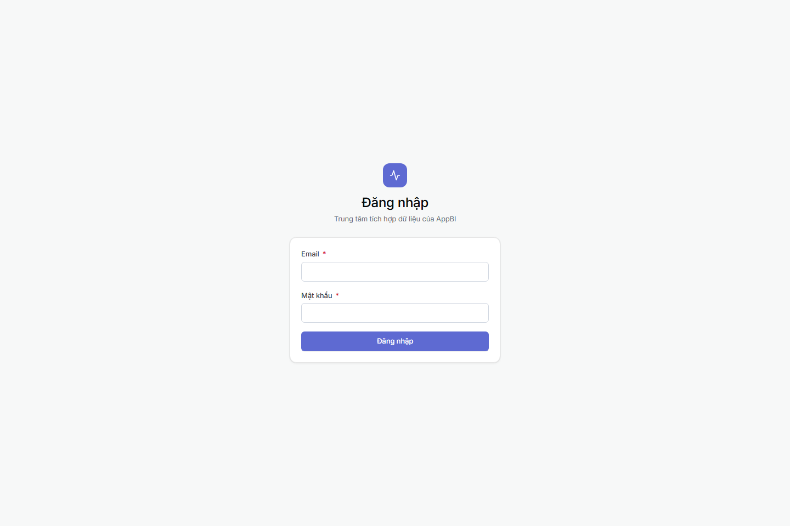

*Hình 1. Màn hình đăng nhập thật, chụp trước khi điền thông tin tài khoản.*

Chọn workspace ở thanh bên. Nguồn, Đích, Pipeline và quyền thao tác gắn với workspace đang chọn. Nếu màn hình dùng tiếng Anh, mở menu tài khoản ở cuối thanh bên và chọn tiếng Việt. Lựa chọn của người dùng trong trình duyệt được ưu tiên hơn `DEFAULT_LOCALE`.

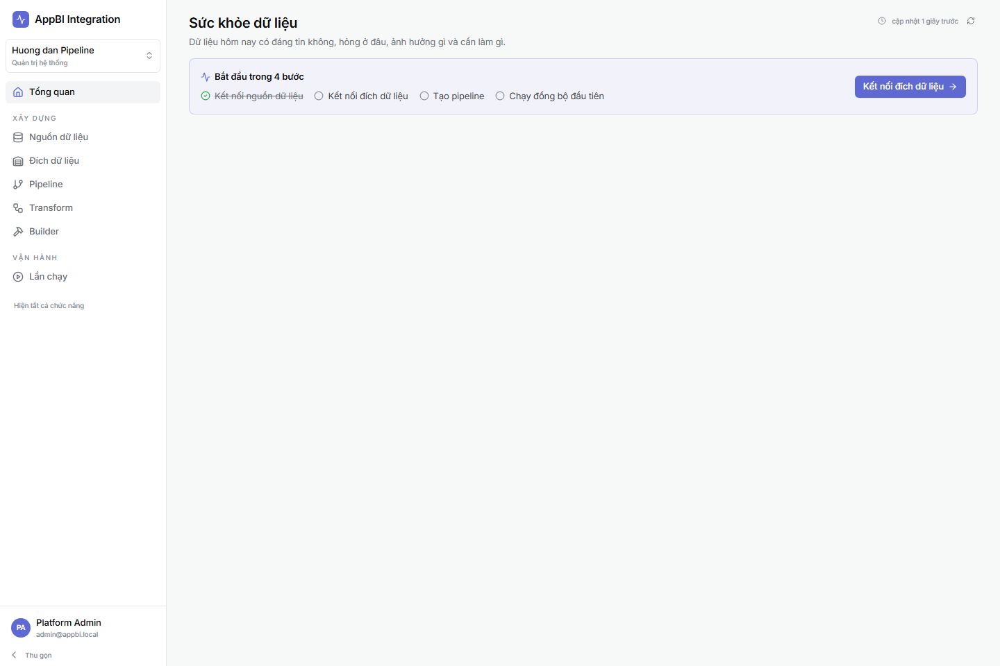

*Hình 2. Tổng quan của workspace sau khi khởi chạy; số liệu phản ánh thời điểm chụp, không phải cam kết hiệu năng.*

## 6 Thực hành Pipeline đầu tiên

### 6.1 Chuẩn bị bài thực hành

Bài mẫu đọc database `demo_source`, schema `shop`, rồi ghi sang `demo_warehouse` trong PostgreSQL local. Không cần tài khoản bên ngoài. Các script trong `docker/postgres/init` chỉ chạy khi volume PostgreSQL rỗng; trên máy có volume cũ, số dòng có thể khác hoặc database mẫu có thể chưa tồn tại.

```powershell
docker compose exec -T postgres psql -U appbi -d postgres -c '\l'
docker compose exec -T postgres psql -U appbi -d demo_source -c 'SELECT count(*) FROM shop.customers;'
```

Bản khởi tạo mới tạo 500 khách hàng, 2.000 đơn hàng và 200 sản phẩm. `SEED_DEMO_DATA=1` tạo tài khoản và workspace; code bootstrap hiện tại **không tự tạo các Nguồn, Đích và Pipeline mẫu**. Người dùng tạo chúng theo các bước dưới đây. Nếu không có database mẫu, xem mục 11; không xóa volume đang sử dụng để có dữ liệu mẫu.

### 6.2 Tạo Nguồn

Vào **Nguồn dữ liệu → Thêm nguồn → PostgreSQL**. Trình hướng dẫn chọn connector, điền cấu hình và kiểm tra kết nối trước khi lưu. Đặt tên dễ phân biệt, ví dụ `Huong dan Shop source`.

| Trường | Giá trị bài thực hành |
|---|---|
| Host | `postgres` |
| Port | `5432` |
| Database | `demo_source` |
| Schema | `shop` |
| Username | `demo_reader` |
| Password | `demo_reader_pw` — tài khoản mẫu trong script init, chỉ dùng local |
| SSL mode | `disable` trong mạng Docker local |
| SSH tunnel | Không dùng tunnel |

Nếu connector yêu cầu phương pháp replication, chọn phương pháp được form hỗ trợ cho Postgres hiện tại. Với bài đầu tiên sẽ đọc full refresh nên chưa cần cấu hình CDC hay replication slot. Không chọn CDC chỉ vì nghĩ đó là điều kiện bắt buộc của mọi sync.

Bấm kiểm tra và chờ kết quả thành công, sau đó lưu. Lần đầu có thể phải tải image connector. Với database thật, dùng tài khoản đọc riêng và SSL theo chính sách máy chủ; không sao chép cấu hình tắt SSL của bài local sang hệ thống thật.

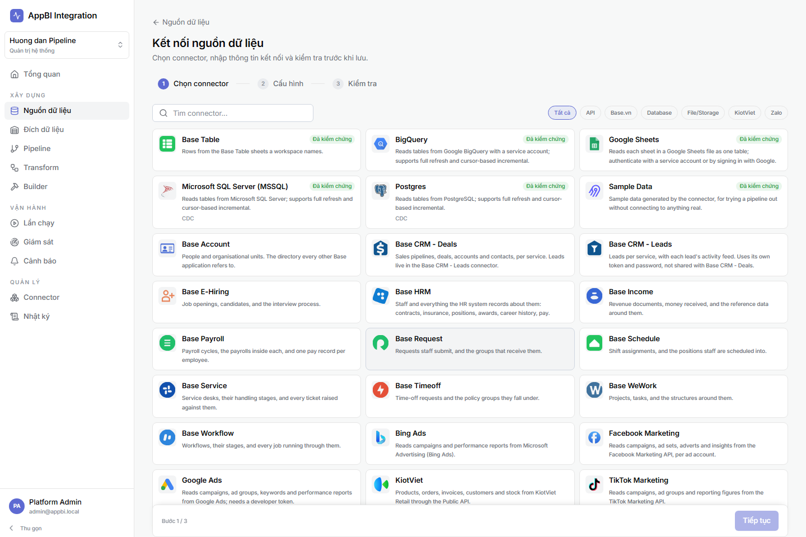

*Hình 3. Chọn connector trong luồng thêm nguồn.*

### 6.3 Tạo Đích

Vào **Đích dữ liệu → Thêm đích → PostgreSQL**. Đặt tên `Huong dan Warehouse`. Dùng `postgres`, port `5432`, database `demo_warehouse`, user `demo_writer`, password mẫu `demo_writer_pw`; schema ví dụ `huong_dan`. Kiểm tra rồi lưu. Dùng schema riêng để bài thực hành không ghi đè bảng đang được báo cáo khác sử dụng.

Host, port và mật khẩu ở đây là kết nối từ container. Không nhập `localhost` cùng `POSTGRES_PORT` của host cho database nằm trong stack. Với BigQuery hoặc Google Sheets, chọn đúng connector và điền các trường mà form hiển thị; quyền đọc ở nguồn không đồng nghĩa với quyền ghi ở đích.

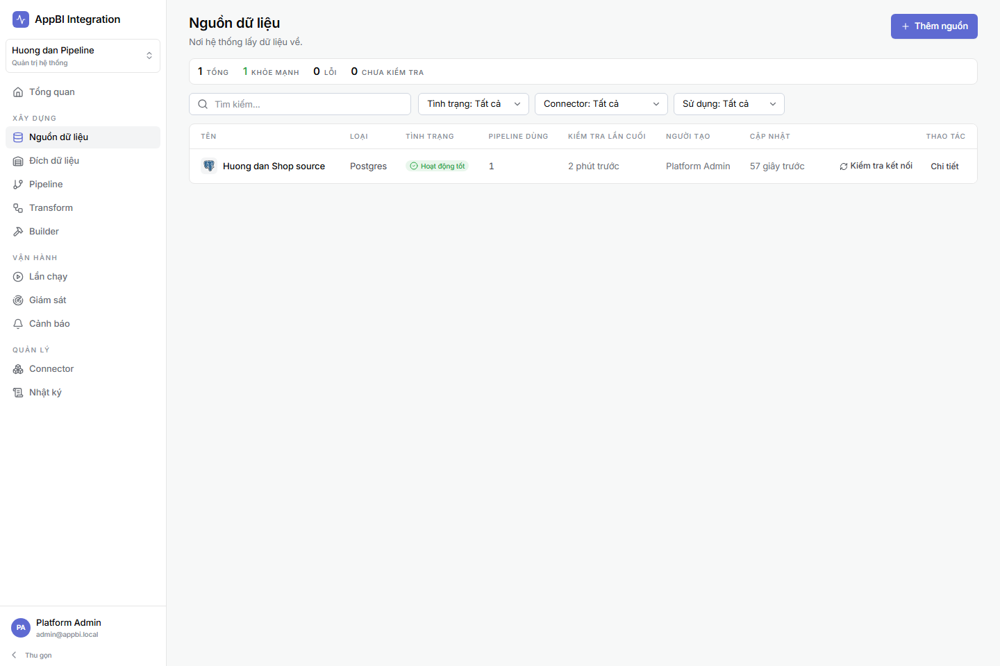

*Hình 4. Danh sách nguồn trong workspace; mở từng nguồn để kiểm tra trạng thái và cấu hình.*

### 6.4 Tạo Pipeline

Vào **Pipeline → Tạo Pipeline**, rồi đi lần lượt bốn bước:

1. **Thông tin:** tên ví dụ `Huong dan Customers`, chọn Nguồn và Đích vừa tạo.
2. **Dữ liệu:** chờ khám phá schema, bấm bỏ chọn tất cả rồi chỉ chọn bảng `customers` cho lần thử đầu. Chọn `Full refresh` và `Overwrite` nếu connector cung cấp.
3. **Lịch chạy:** chọn thủ công cho lần thử đầu. Ở phần tùy chọn đích ngay dưới lịch, đặt **Mẫu namespace ở đích** thành `huong_dan`, để trống prefix. Phải đặt ở Pipeline: schema trong form Đích chỉ là giá trị mặc định; nếu giữ namespace nguồn, dữ liệu có thể về `shop.customers` dù form Đích ghi `huong_dan`. Khi bật lịch, chọn `Asia/Ho_Chi_Minh` hoặc `Asia/Bangkok`. Giữ chính sách bỏ qua khi đang chạy nếu không cần xếp hàng.
4. **Xác nhận:** kiểm tra tên, nguồn, đích, bảng và chế độ ghi; chọn có chạy ngay lần đầu hay không, rồi tạo.

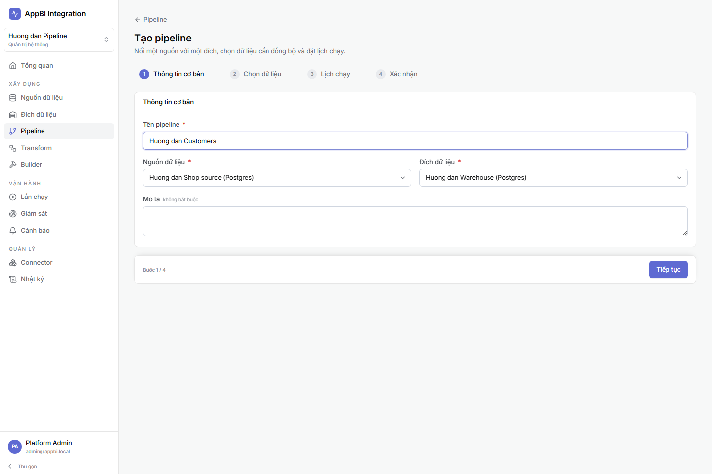

*Hình 5. Trình hướng dẫn tạo Pipeline; phải chọn đúng Nguồn và Đích trước khi khám phá dữ liệu.*

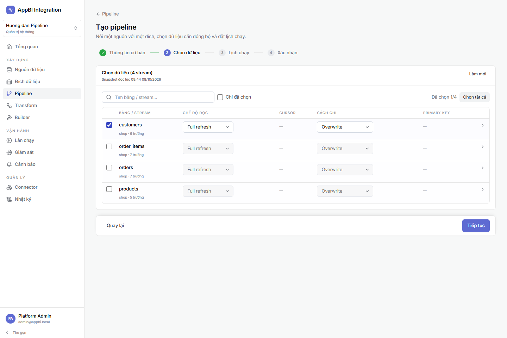

*Hình 6. Bài thực hành chỉ chọn customers; các bảng khác không được chọn.*

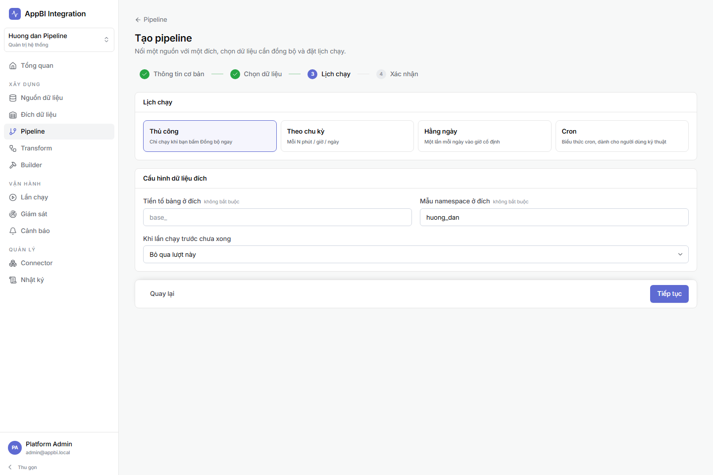

*Hình 7. Lịch thủ công và namespace huong_dan giúp xác định rõ nơi ghi dữ liệu.*

| Cách đồng bộ | Ý nghĩa | Điều kiện cần xem |
|---|---|---|
| Full refresh và overwrite | Đọc lại toàn bộ và thay dữ liệu của bảng đích theo khả năng connector | Phạm vi bảng đích, ảnh hưởng dữ liệu cũ |
| Incremental và append | Đọc phần tiếp theo và thêm vào đích | Cursor đúng; có thể phát sinh bản ghi trùng tùy nguồn và replay |
| Incremental và append dedup | Đọc tăng dần, khử trùng theo khóa nếu connector hỗ trợ | Primary key ổn định và cursor hợp lệ |

Không phải mọi connector hỗ trợ mọi tổ hợp. Chỉ chọn các chế độ mà giao diện hiển thị cho stream đó. Bản source này hỗ trợ `namespace_format` và `stream_prefix` cả với embedded. Nếu namespace để trống, engine giữ namespace do nguồn phát ra; `${SOURCE_NAMESPACE}` biểu diễn namespace nguồn trong mẫu. Với bài thực hành này đặt cố định `huong_dan` để tách bảng đích khỏi schema `shop` của các demo khác.

### 6.5 Chạy và kiểm tra kết quả

Mở Pipeline, bấm **Chạy ngay** nếu chưa chọn chạy lần đầu. Theo dõi từ `QUEUED` qua `STARTING`, `RUNNING` tới trạng thái kết thúc. Vào lịch sử job, mở lần chạy để xem tổng dòng, từng stream và log.

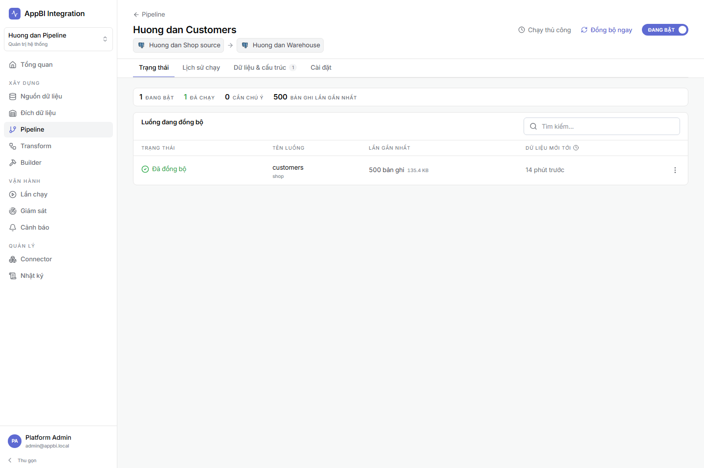

*Hình 8. Chi tiết Pipeline và lịch sử chạy của sản phẩm đang hoạt động.*

`SUCCEEDED` nghĩa là engine báo hoàn tất; vẫn đối chiếu số liệu nguồn và dữ liệu đích. `PARTIAL_SUCCESS` cần xem stream lỗi. Không dùng riêng số dòng trong UI để kết luận đã có bảng nghiệp vụ cuối cùng, vì hình dạng bảng raw và typing phụ thuộc connector đích.

```powershell
docker compose exec -T postgres psql -U appbi -d demo_warehouse -c '\dn'
docker compose exec -T postgres psql -U appbi -d demo_warehouse -c '\dt *.*'
```

Sau khi xác định đúng schema và tên bảng từ kết quả trên, thực hiện `SELECT count(*)` trên bảng đó. Không giả định mọi phiên bản connector đều đặt tên bảng giống nhau. Nếu chạy incremental lần hai không có dòng mới, đó có thể là kết quả đúng khi dữ liệu nguồn chưa thay đổi.

### 6.6 Bật lịch khi lần thử đã đúng

Trong cài đặt Pipeline, đổi từ thủ công sang khoảng thời gian, hằng ngày hoặc cron. Giao diện hiện có các khoảng 15 phút, 30 phút, 1 giờ, 3 giờ, 6 giờ, 12 giờ, 24 giờ. Backend mặc định giới hạn tối thiểu 300 giây; giao diện không nhất thiết liệt kê mọi khoảng backend cho phép.

Ví dụ cron `0 2 * * *` chạy hằng ngày lúc 02:00 theo múi giờ đã chọn. Kiểm tra ba thời điểm chạy tiếp theo được hiển thị trước khi lưu. Khi Pipeline đang chạy, `SKIP_IF_RUNNING` bỏ qua lần đến lịch; `QUEUE` xếp hàng theo chính sách. Không tăng tần suất để xử lý job chậm; trước hết xem thời gian sync và giới hạn tài nguyên.

## 7 Sử dụng hằng ngày

### 7.1 Quy trình đầu ngày

Mở Tổng quan của đúng workspace, xem Pipeline lỗi, dữ liệu quá cũ và cảnh báo. Mở lịch sử lần chạy mới nhất của Pipeline quan trọng. Khi có bất thường, kiểm tra thời điểm bắt đầu, stream bị ảnh hưởng và log trước khi bấm chạy lại.

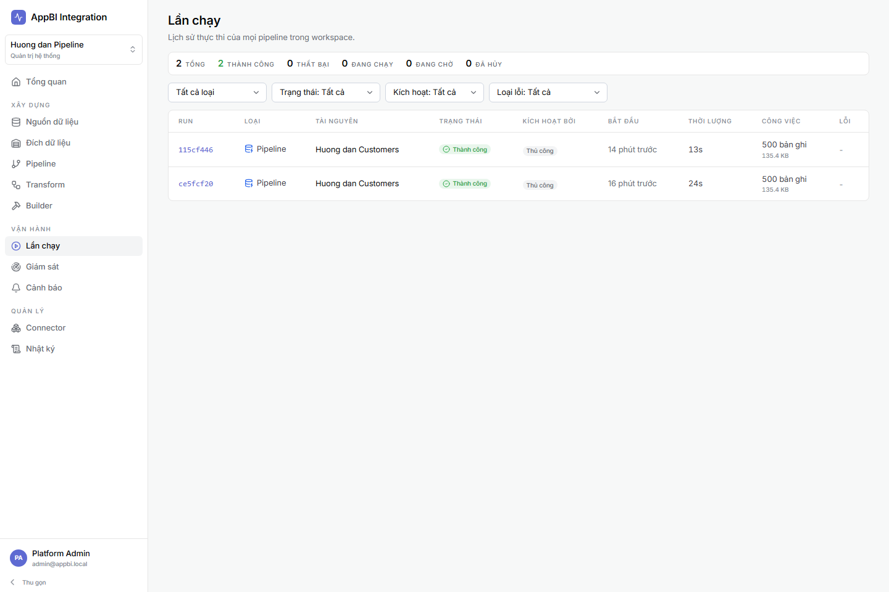

*Hình 9. Lịch sử chạy giúp phân biệt công việc đang chờ, đang chạy và đã kết thúc.*

**Tạm dừng Pipeline** chủ yếu ngăn các lần chạy theo lịch mới. Nếu cần dừng một job đang chạy, dùng thao tác hủy của chính job đó và chờ trạng thái kết thúc. Không coi việc đóng tab trình duyệt là hủy sync; worker vẫn chạy độc lập.

Khi schema nguồn thay đổi, dùng khám phá lại và xem diff. Đọc danh sách bảng/cột thêm, bỏ hoặc đổi kiểu trước khi duyệt. Xóa stream hoặc reset cursor có thể làm thay đổi dữ liệu đã đến kho và đòi hỏi quyền riêng; không dùng như thao tác retry thông thường.

### 7.2 Nguồn Base

Chọn đúng tên miền Base mà tổ chức sử dụng, ví dụ `base.vn` hoặc `base.com.vn`; token không dùng thay thế giữa các môi trường này. Mỗi ứng dụng Base có token và phạm vi quyền riêng. Nếu token mới vẫn bị từ chối, đối chiếu tên miền và ứng dụng trước khi cấp token mới.

Điền đủ các trường bắt buộc hiện trên form, bao gồm ID tài nguyên khi connector yêu cầu. Danh mục connector thay đổi theo phiên bản source; lấy form và tab hướng dẫn của connector đang chạy làm căn cứ, không suy ra tất cả connector đều chỉ cần một token.

### 7.3 Transform

Transform là không gian làm việc cho dự án dbt. File trong project là nguồn sự thật: SQL, YAML, macro, seed, snapshot và `dbt_project.yml` được giữ nguyên như một dự án dbt thông thường. Tính năng cần `WITH_TRANSFORM=1`, overlay `docker-compose.transform.yml`, service `transform-worker` đang chạy và một kết nối warehouse hợp lệ.

#### 7.3.1 Kiểm tra trước khi tạo dự án

```powershell
docker compose ps transform-worker
docker compose exec -T transform-worker dbt --version
Invoke-RestMethod 'http://localhost:8080/readyz?deep=1' | ConvertTo-Json -Depth 8
```

Kết quả mong đợi là `transform-worker` ở trạng thái Up, dbt in được phiên bản core và adapter, còn readiness có `transform_storage.ok=true`. Nếu menu Transform vẫn xuất hiện nhưng worker không chạy, người dùng có thể sửa file nhưng các lệnh dbt sẽ nằm chờ hoặc thất bại.

#### 7.3.2 Chọn nguồn dự án

Vào **Transform → Dự án mới**. Bước đầu có bốn cách bắt đầu:

| Lựa chọn | Dùng khi nào | Điều cần kiểm tra |
|---|---|---|
| Tạo dự án dbt mới | Chưa có project; muốn dùng khung mẫu chuẩn | Có thể tạo model và test mẫu để chạy ngay |
| Kết nối repository đã có | Project đang được quản lý bằng Git | URL, branch, thư mục con và token; phải bấm kiểm tra repository trước khi tiếp tục |
| Tải lên dự án dbt | Nhận project dưới dạng ZIP | ZIP phải chứa `dbt_project.yml`; không đưa credential hoặc `profiles.yml` vào gói |
| Bắt đầu từ file SQL | Có các query rời cần chuyển thành model | Tải file, xem quan hệ phụ thuộc, xử lý vòng lặp và xác nhận tên model trước khi import |

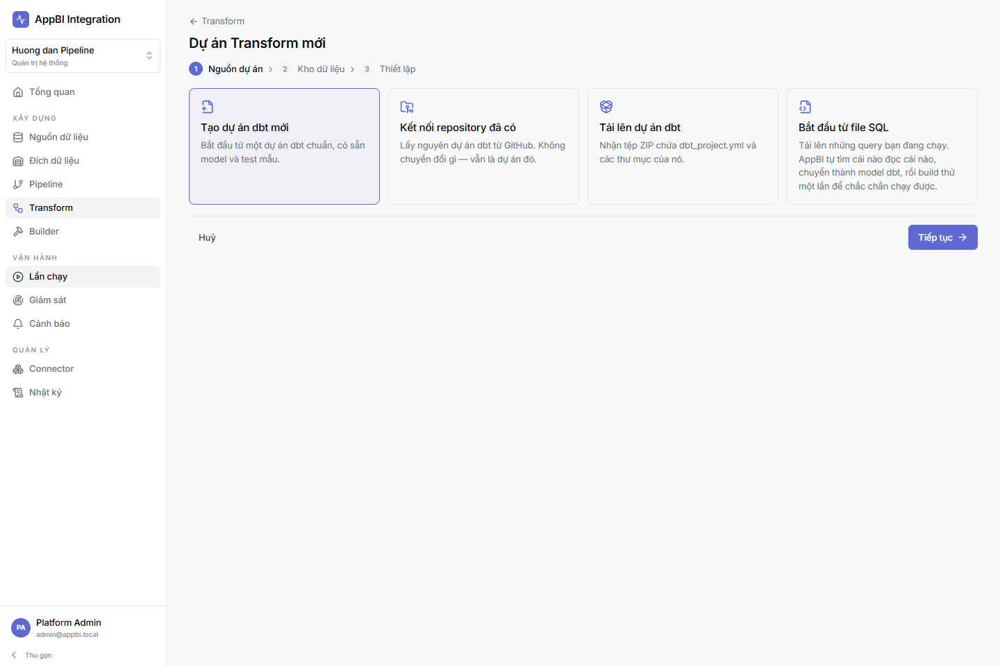

*Hình 10. Bốn cách bắt đầu một dự án Transform.*

Với Git, AppBI lấy nguyên project chứ không chuyển đổi nội dung. `auto pull` chỉ phù hợp khi quy trình nhóm đã quy định rõ cách xử lý thay đổi cục bộ; pull không được phép âm thầm ghi đè file đang sửa. Với SQL import, bước phân tích chỉ đề xuất cấu trúc; phải xem lại model name, layer, phụ thuộc và các file sẽ được ghi.

#### 7.3.3 Chọn warehouse và đặt schema

Chọn đúng adapter BigQuery hoặc PostgreSQL, sau đó chọn kết nối đã kiểm tra. Nếu tạo kết nối PostgreSQL mới từ stack local, dùng `postgres:5432`, database `demo_warehouse`, tài khoản ghi của warehouse; không dùng `localhost:15433` vì dbt chạy trong container. Credential được lưu riêng khỏi project.

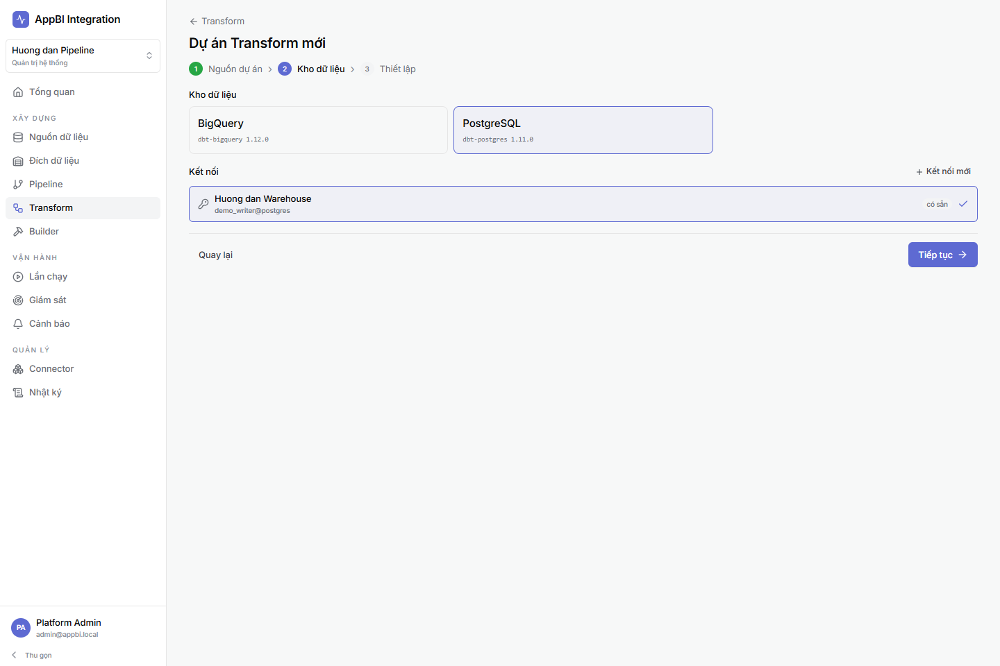

*Hình 11. Dự án hướng dẫn dùng kết nối PostgreSQL `Huong dan Warehouse`.*

Ở bước thiết lập, phân biệt ba schema:

| Trường | Ý nghĩa | Giá trị bài thực hành |
|---|---|---|
| Schema dữ liệu nguồn | Nơi Pipeline đã ghi dữ liệu thô | `huong_dan` |
| Schema khi phát triển | Nơi Preview/Build bản nháp ghi kết quả | `analytics_dev` |
| Schema chạy thật | Nơi release đang hoạt động ghi kết quả | `analytics` |

Tên dbt project chỉ dùng chữ thường, số và gạch dưới. Bật **Mỗi người một schema riêng** khi nhiều người cùng phát triển và cần tránh ghi đè relation của nhau. Với bài thực hành một người, để tắt. Bật model/test mẫu giúp kiểm chứng runtime trước khi viết logic thật.

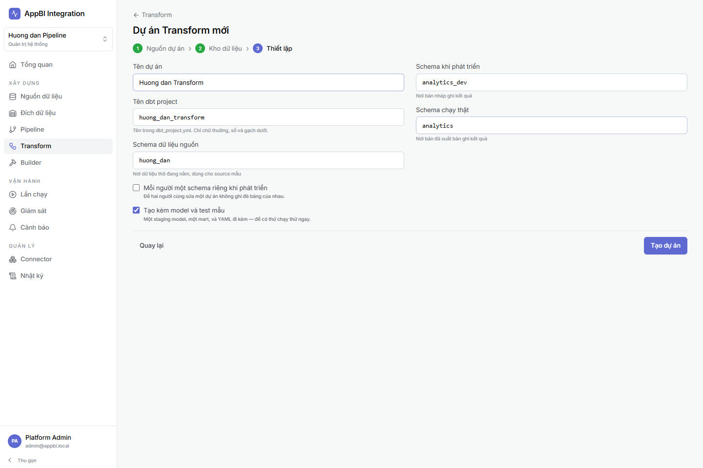

*Hình 12. Thiết lập project `huong_dan_transform` với schema phát triển và chạy thật tách biệt.*

#### 7.3.4 Hiểu màn hình làm việc

Sau khi tạo, chờ nhãn **Parse ✓** rồi mới kết luận project hợp lệ. Màn hình gồm:

- **PROJECT**: cây file thật của project; mở, tạo, đổi tên và xóa file.
- **RESOURCES**: model, source, test, seed, snapshot và metric đã được dbt nhận diện.
- **Editor**: nội dung file đang mở. Dấu chấm trên tab hoặc nút **Lưu tất cả** sáng nghĩa là còn buffer chưa lưu.
- **Preview / Results / Problems / Compiled / Logs**: dữ liệu xem trước, kết quả theo node, lỗi tổng hợp, SQL đã compile và log đầy đủ.
- **Thanh lệnh cuối màn hình**: chạy lệnh dbt có cấu trúc; đây không phải shell tự do.
- **Xuất bản**: đóng băng đúng revision hiện tại, kiểm tra nó, rồi mới có thể đưa vào chạy thật.

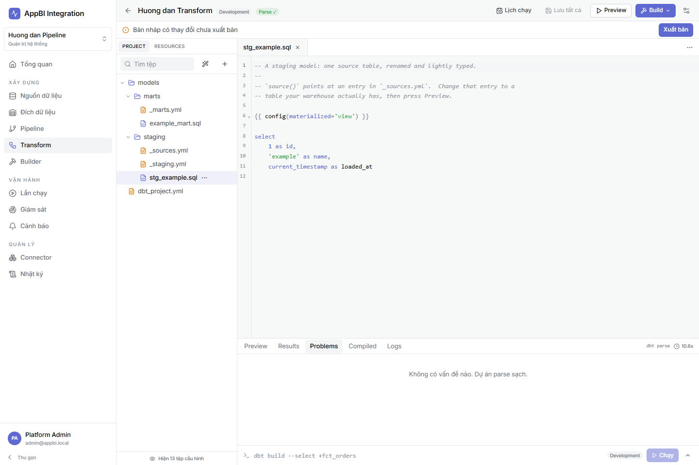

*Hình 13. File `stg_example.sql`, trạng thái Parse sạch và các khu vực chính của workbench.*

Lưu một file bằng `Ctrl+S`, lưu tất cả bằng `Ctrl+Shift+S` hoặc nút **Lưu tất cả**. Mỗi lần lưu tạo revision mới và xếp một lệnh parse. Nếu người khác đã lưu từ revision mới hơn, giao diện báo xung đột và hiển thị hai phiên bản; không ghi đè im lặng.

#### 7.3.5 Trình tự phát triển và các lệnh

Thực hiện theo thứ tự sau:

1. Sửa hoặc tạo file SQL/YAML rồi lưu.
2. Chờ `parse` hoàn tất; sửa hết lỗi trong **Problems**.
3. Chạy `debug` khi cần xác nhận credential và kết nối warehouse.
4. Chạy `compile` để xem SQL sau Jinja trong tab **Compiled**.
5. Dùng **Preview** (`dbt show`) trên model đang chọn để xem tập dữ liệu giới hạn.
6. Chạy **Build this** cho model, sau đó **Build upstream/downstream** nếu cần kiểm tra đồ thị liên quan.
7. Chạy **Build all** trước khi phát hành để thực thi model, test, seed và snapshot thuộc project.

| Lệnh | Tác dụng | Có ghi vào warehouse? |
|---|---|---|
| `parse` | Đọc project, dựng manifest và phát hiện lỗi cấu hình/Jinja | Không |
| `debug` | Kiểm tra profile, adapter và kết nối | Không ghi model |
| `compile` | Sinh SQL sau Jinja/ref/source | Không |
| `show` | Compile và chạy truy vấn xem trước với giới hạn | Có chạy truy vấn đọc |
| `run` | Chạy model được chọn | Có |
| `test` | Chạy data test/schema test | Có truy vấn kiểm tra |
| `build` | Chạy tài nguyên theo quan hệ phụ thuộc và test | Có |
| `seed`, `snapshot` | Nạp CSV seed hoặc cập nhật snapshot | Có |
| `source freshness` | Kiểm tra độ mới của source có cấu hình freshness | Đọc metadata/source |

Selector là cú pháp của dbt, ví dụ `stg_customers`, `+fct_orders`, `fct_orders+`, `tag:daily`. Dấu `+` phía trước lấy upstream; phía sau lấy downstream. Chỉ dùng **Full refresh** khi hiểu tác động tới model incremental và thời gian chạy.

Trong lần kiểm chứng, `dbt build` của project hướng dẫn hoàn tất trong khoảng 9 giây: 2 model thành công, 4 test đạt, không có node lỗi. Relation phát triển được tạo trong `demo_warehouse.analytics_dev`.

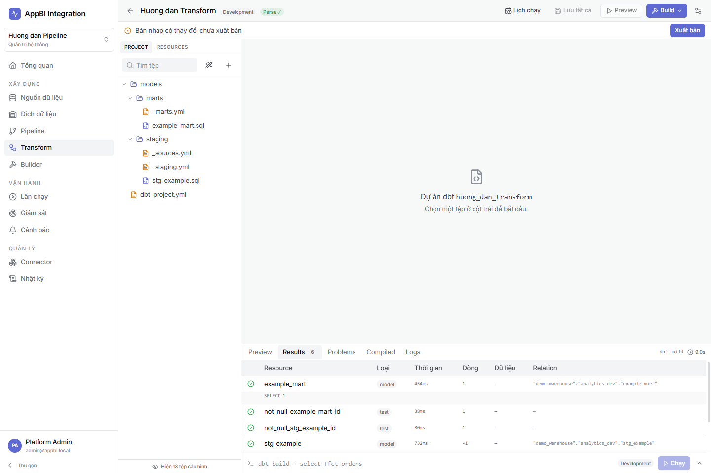

*Hình 14. Tab Results cho biết từng model/test, thời gian, số dòng và relation đích.*

Không chỉ nhìn thông báo “đã gửi lệnh”. Một invocation chỉ thành công khi trạng thái cuối là `SUCCEEDED`, exit code bằng 0 và không có node lỗi. Khi cần đối chiếu từ container:

```powershell
docker compose logs --tail 200 transform-worker
docker compose exec -T postgres psql -U appbi -d demo_warehouse -c '\dt analytics_dev.*'
```

#### 7.3.6 Phát hành, kích hoạt và đặt lịch

**Build bản nháp** và **Release đang chạy thật** là hai trạng thái riêng. Nhấn **Xuất bản** tạo một release đóng băng đúng revision, sau đó hệ thống chạy một `dbt build` xác minh. Trạng thái có ý nghĩa như sau:

| Trạng thái release | Ý nghĩa |
|---|---|
| `VERIFYING` | Đang build revision đã đóng băng |
| `FAILED` | Xác minh lỗi; không được kích hoạt |
| `READY` | Xác minh đạt nhưng chưa chạy thật nếu không chọn tự kích hoạt |
| `ACTIVE` | Phiên bản đang được lịch/production sử dụng |
| `RETIRED` | Phiên bản cũ đã được thay thế nhưng vẫn có thể dùng để rollback có chủ đích |

Build Development thành công không đảm bảo bước xác minh Release sẽ thành công vì đó là một invocation mới trên revision đóng băng. Nếu release thất bại, mở **Lịch sử chạy → Problems → Logs**, sửa bản nháp, build lại và phát hành release mới. Không kích hoạt release `FAILED`; không coi việc nhấn **Xuất bản** là đã chạy production.

Đặt lịch sau khi có release `ACTIVE`. Các lệnh được phép đặt lịch gồm `build`, `run`, `test`, `seed`, `snapshot` và `source freshness`. Chọn múi giờ đúng, xem các lần chạy kế tiếp và để khoảng đệm sau Pipeline ingest. Lịch Transform độc lập với lịch Pipeline; code hiện tại không tự kích hoạt Transform khi Pipeline upstream hoàn tất, và lineage không tự tạo trigger.

#### 7.3.7 Xử lý lỗi Transform

| Triệu chứng | Kiểm tra và xử lý |
|---|---|
| Lệnh nằm `QUEUED` lâu | Kiểm tra `transform-worker`, giới hạn song song và invocation khác đang ghi cùng environment |
| `TRANSFORM_NOT_INSTALLED` | Build lại image với `WITH_TRANSFORM=1` và giữ overlay Transform trong `COMPOSE_FILE` |
| Parse lỗi | Mở **Problems**, sửa `dbt_project.yml`, YAML, Jinja hoặc package; lưu và chờ parse mới |
| Debug lỗi kết nối | Kiểm tra host container, database, quyền tạo schema/table và SSL; xác minh lại warehouse connection |
| Compile đạt nhưng build lỗi | Đọc node đầu tiên lỗi và SQL compiled; compile không kiểm tra quyền ghi hay SQL thật trên warehouse |
| Build Development đạt nhưng Release lỗi | Đọc invocation xác minh của release; sửa nguyên nhân rồi tạo release mới |
| Không thấy relation | Xác nhận environment/schema đang chạy và materialization; xem cột Relation trong Results |
| Model incremental sai dữ liệu | Kiểm tra `unique_key`, điều kiện `is_incremental()`, cursor nguồn và cân nhắc full refresh có kiểm soát |
| Không thấy thay đổi trên production | Kiểm tra release có thực sự `ACTIVE`, không chỉ `READY` hoặc `FAILED` |

### 7.4 Connector Builder

Builder tạo source connector cho REST API chưa có trong danh mục. Kết quả là một declarative manifest chạy bằng connector runner của hệ thống. Builder không phải nơi biến đổi dữ liệu trong warehouse; việc đó thuộc Transform.

#### 7.4.1 Tạo bản nháp

Vào **Builder → Tạo connector**. Có hai cách:

- **AI đề xuất**: đưa tài liệu OpenAPI, Postman, PDF, ảnh, văn bản hoặc URL tài liệu. AI tạo kế hoạch có bằng chứng; người dùng phải rà từng stream và bấm áp dụng.
- **Tạo thủ công**: đặt tên, mô tả và biểu tượng rồi cấu hình từng phần. Đây là đường thực hành dễ kiểm chứng nhất.

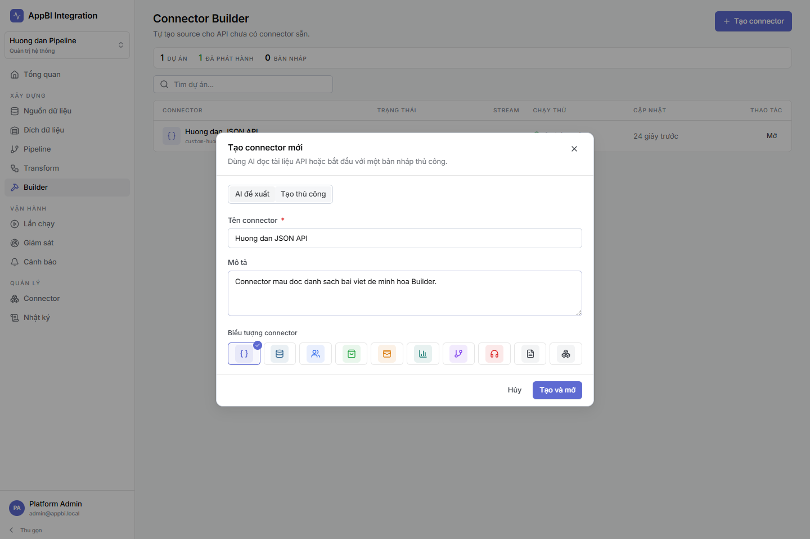

*Hình 15. Tạo bản nháp thủ công; credential không được đặt trong mô tả.*

AI Builder là tùy chọn và cần khóa dịch vụ ở backend. Thiếu khóa AI không ảnh hưởng Pipeline, Builder thủ công hoặc connector đã phát hành. Không tải credential vào tài liệu và không dán secret vào prompt; secret chỉ nhập ở phần chạy thử hoặc form tạo Nguồn.

#### 7.4.2 Cấu hình chung và tham số người dùng

Trong **Cấu hình chung**, điền Base URL không có đường dẫn stream, ví dụ `https://jsonplaceholder.typicode.com`. Chọn một phương thức xác thực:

| Phương thức | Trường thường cần |
|---|---|
| Không cần | API công khai |
| API key | Tên header hoặc query parameter và giá trị key |
| Bearer token | Token gắn vào `Authorization` |
| Basic auth | Username và password |
| OAuth 2.0 refresh token | Token endpoint, client ID, client secret, refresh token, scopes |
| JWT | Secret, thuật toán và thời hạn token |
| Session token | Login path, vị trí token trong response, header nhận token |

**Tham số người dùng** là các trường sẽ xuất hiện khi người dùng tạo Nguồn từ connector đã phát hành. Khóa dùng chữ thường, số và gạch dưới, bắt đầu bằng chữ thường. Đánh dấu `secret` cho token/password; secret không có giá trị mặc định. Tham chiếu trong path, query, header hoặc body bằng `{{ config['ten_khoa'] }}`. Khi đổi tên một input trong giao diện, Builder cập nhật các tham chiếu mà nó quản lý; vẫn phải chạy thử lại.

#### 7.4.3 Cấu hình stream

Mỗi stream tương ứng một tập bản ghi. Tên stream bắt đầu bằng chữ hoặc gạch dưới, chỉ chứa chữ, số và gạch dưới. Bài thực hành dùng:

| Trường | Giá trị |
|---|---|
| Base URL | `https://jsonplaceholder.typicode.com` |
| Stream | `posts` |
| Path | `/posts` |
| Method | `GET` |
| Record selector | Để trống vì response là mảng ở gốc |
| Primary key | `id` |

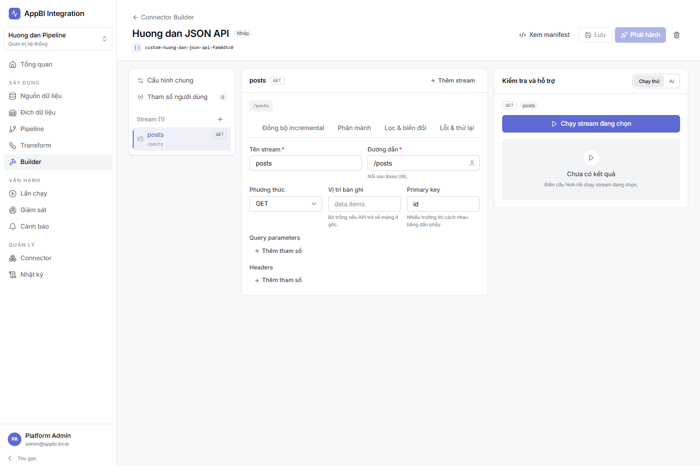

*Hình 16. Stream `posts` đọc mảng JSON ở gốc và dùng `id` làm khóa.*

Sáu nhóm cấu hình của stream:

1. **Yêu cầu HTTP**: path, GET/POST, record selector, primary key, query, header và body JSON/form.
2. **Phân trang**: none, page number, offset, cursor hoặc Link header. Điền đúng page parameter, page size, điểm bắt đầu và nơi chèn giá trị.
3. **Đồng bộ incremental**: cursor field, định dạng thời gian, tham số bắt đầu/kết thúc, step và lookback. Nếu API không hỗ trợ lọc server, chế độ lọc client vẫn tải mọi bản ghi rồi mới bỏ bản cũ; nó không tiết kiệm lượt gọi API.
4. **Phân mảnh**: chạy cùng stream cho một danh sách giá trị hoặc theo từng bản ghi của stream cha. Với stream con, phải truyền ID cha bằng parameter hoặc `{{ stream_partition.parent_id }}`; chỉ chọn stream cha mà không gửi ID sẽ đọc lặp cùng dữ liệu.
5. **Lọc & biến đổi**: Jinja record filter; thêm hoặc xóa trường theo path. Dùng cho chuẩn hóa nhẹ ở connector, không thay thế dbt.
6. **Lỗi & thử lại**: số lần retry, backoff cố định/tăng dần/theo header và hành động theo status code/body: retry, rate limited, ignore hoặc fail.

Các chế độ phân trang phải được xác nhận bằng tab **Request**, không chỉ bằng số bản ghi trả về. API có thể trả 200 nhưng Builder vẫn đang đọc mãi trang đầu, bỏ trang sau hoặc dừng quá sớm.

#### 7.4.4 Lưu, chạy thử và đọc bằng chứng

Quy trình đúng là:

1. Cấu hình xong một stream rồi bấm **Lưu**.
2. Nhập credential chạy thử nếu có; giá trị được mã hóa tạm thời cho test session và tự hết hạn, không lưu trong bản nháp.
3. Bấm **Chạy stream đang chọn**.
4. Xem đủ bốn tab **Bản ghi**, **Schema**, **Request** và **Log**.
5. Nếu schema suy luận đúng, bấm **Áp dụng schema**, lưu và chạy thử lại vì definition đã thay đổi.
6. Lặp lại cho từng stream, bao gồm stream con và trang cuối.

Trong lần kiểm chứng, stream `posts` đọc được 25 bản ghi trong cửa sổ test, nhận diện 4 trường (`userId`, `id`, `title`, `body`), ghi nhận 1 request và 14 dòng log. Preview hiển thị 8/25 bản ghi. Giới hạn test là để giữ một lần thử có kiểm soát; nó không khẳng định API chỉ có 25 bản ghi.

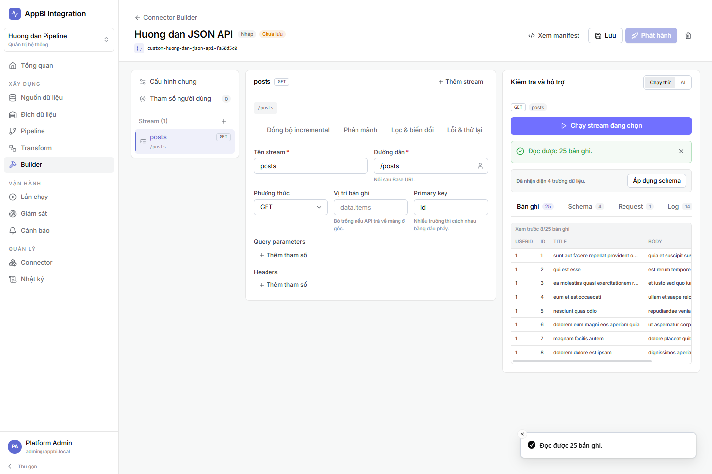

*Hình 17. Kết quả test phải có dữ liệu, schema, request thực tế và log để đối chiếu.*

Sau bất kỳ thay đổi nào làm nút **Chưa lưu** xuất hiện, cần lưu và chạy thử lại. Nút **Phát hành** chỉ mở khi bản definition hiện tại đã có test thành công; test của phiên bản cũ không đủ.

#### 7.4.5 Phát hành và sử dụng connector

Nhấn **Phát hành** biên dịch definition thành manifest, đăng ký hoặc cập nhật connector trong workspace và tăng số phiên bản phát hành. Bản kiểm chứng đã phát hành `Huong dan JSON API` và connector hiển thị trạng thái đã chạy thử.

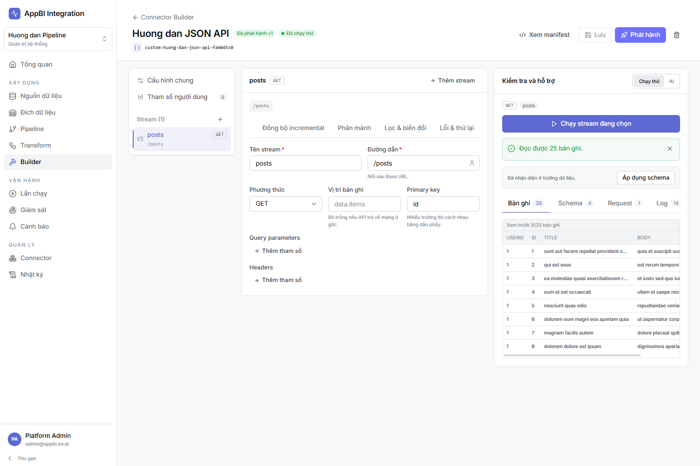

*Hình 18. Nhãn phát hành và chạy thử cho biết bản connector hiện tại đã qua test.*

Sau khi phát hành, vào **Nguồn dữ liệu → Thêm nguồn**, tìm theo tên connector. Chọn nó, nhập các tham số người dùng/secret, kiểm tra kết nối rồi lưu giống connector tích hợp sẵn. Việc phát hành không tự tạo Nguồn và không tự thêm connector vào Pipeline.

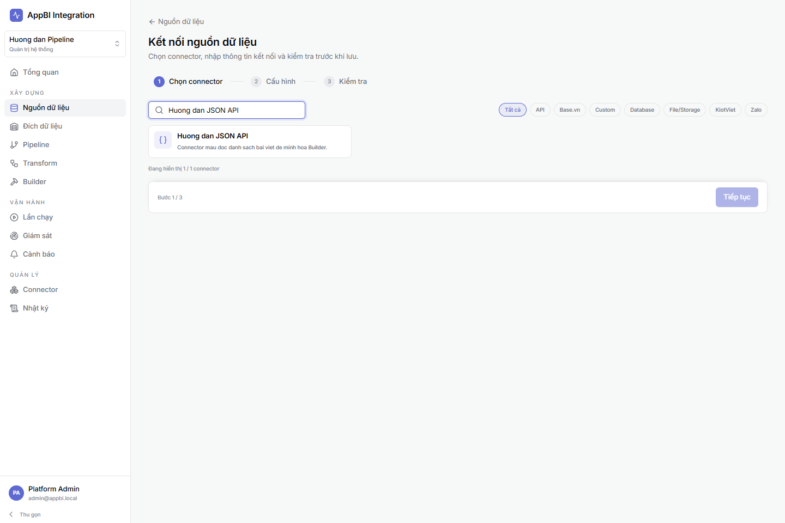

*Hình 19. Connector tùy chỉnh xuất hiện trong danh mục sau khi phát hành.*

**Xem manifest** dùng để rà document thực thi hoặc xuất YAML. Import manifest thay thế trạng thái editor; hệ thống từ chối thành phần chưa được Builder hỗ trợ và không ghi đè bản nháp nếu manifest không compile được. Sau import phải test lại trước khi phát hành.

#### 7.4.6 Checklist trước khi phát hành

- Base URL và path ghép thành đúng endpoint, không lặp hoặc thiếu dấu `/`.
- Record selector trỏ đúng mảng bản ghi, không phải error envelope hay metadata.
- Primary key ổn định; nếu là khóa ghép, điền đủ các trường.
- Phân trang đã đi đến trang cuối và không lặp trang đầu.
- Incremental gửi đúng mốc thời gian; bản ghi cập nhật muộn được xử lý bằng lookback phù hợp.
- Stream con thật sự mang ID cha trong request.
- Retry không che lỗi 401/403; rate limit tôn trọng header/thời gian chờ của API.
- Schema đã áp dụng, lưu và test lại trên definition hiện tại.
- Tab Request/Log không làm lộ secret; thông tin trả về được hệ thống làm sạch nhưng vẫn nên rà trước khi chia sẻ.

#### 7.4.7 Xử lý lỗi Builder

| Triệu chứng | Kiểm tra và xử lý |
|---|---|
| Test trả 401/403 | Kiểm tra loại auth, tên header/query parameter, scope và môi trường token |
| HTTP 200 nhưng 0 bản ghi | Kiểm tra record selector; xem tab Request và body/log thay vì chỉ status code |
| Chỉ có trang đầu | Kiểm tra mode pagination, page/cursor path, size parameter, điều kiện dừng và nơi inject |
| Bản ghi bị trùng | Kiểm tra primary key, cursor, lookback và paginator có lặp token/page không |
| Stream con trả dữ liệu giống nhau | ID cha chưa được inject vào path/query/header/body |
| Incremental vẫn gọi toàn bộ dữ liệu | Đang dùng client-side filter hoặc API không hỗ trợ tham số thời gian |
| Không thể phát hành | Lưu definition hiện tại rồi chạy test thành công; xem lỗi compile manifest |
| Đã phát hành nhưng không thấy trong danh mục | Làm mới catalog, kiểm tra đúng workspace và trạng thái project là `PUBLISHED` |
| AI báo chưa cấu hình | Thêm cấu hình AI ở backend nếu muốn dùng; tiếp tục bằng chế độ thủ công nếu không cần AI |

### 7.5 Người dùng và phân quyền

Tổ chức quản lý người dùng; workspace quản lý phạm vi tài nguyên. Các vai trò workspace gồm Owner, Data Admin, Connector Dev, Operator, Analyst và Auditor. Trong code hiện tại, vai trò là bộ quyền khởi đầu; quản trị viên có thể chỉnh quyền cụ thể theo module.

Nếu không thấy nút hoặc gặp 403, kiểm tra workspace, tư cách thành viên và quyền của hành động. `operate` cho chạy/hủy/thử lại khác với `reset`; thay credential dùng `manage_credentials`; xem bản ghi/log có dữ liệu dùng `view_data`. Đổi vai trò không phải cách xử lý mọi lỗi hệ thống.

## 8 Các lệnh vận hành thường dùng

Các lệnh Compose dưới đây tự đọc `.env` và danh sách overlay. Không tùy tiện thêm `-f docker-compose.yml` đơn lẻ vì có thể bỏ socket embedded hoặc Transform.

| Nhu cầu | Lệnh PowerShell |
|---|---|
| Xem cả tác vụ đã thoát | `docker compose ps -a` |
| Xem log API | `docker compose logs -f --tail 100 api` |
| Xem log xử lý sync | `docker compose logs -f --tail 100 worker` |
| Xem log dbt worker | `docker compose logs -f --tail 100 transform-worker` |
| Xem log migration | `docker compose logs --tail 150 migrate` |
| Dừng giữ container và dữ liệu | `docker compose stop` |
| Bật lại đúng container cũ | `docker compose start` |
| Áp source/cấu hình mới | `powershell -NoProfile -ExecutionPolicy Bypass -File .\run.ps1` |
| Tạo lại container giữ volume | `powershell -NoProfile -ExecutionPolicy Bypass -File .\run.ps1 -Fresh` |
| Dùng image có sẵn không build | `powershell -NoProfile -ExecutionPolicy Bypass -File .\run.ps1 -NoBuild` |
| Gỡ container và network, giữ volume | `docker compose down` |
| Theo dõi RAM và CPU | `docker stats --no-stream` |
| Kiểm tra dung lượng Docker | `docker system df` |
| Kiểm tra cú pháp Compose không in secret | `docker compose config --quiet` |

Nhấn `Ctrl+C` khi đang theo dõi `logs -f` chỉ thoát việc xem log. `-NoBuild` không áp dụng code vừa pull. `start` không áp dụng biến môi trường mới. Tránh in `docker compose config` đầy đủ vào ticket vì output có thể chứa secret đã nội suy.

## 9 Cài đặt bằng Linux hoặc Git Bash

```bash
git clone https://github.com/QuangChinhDE/appbi-pipeline.git
cd appbi-pipeline
bash ./run.sh
```

Cập nhật:

```bash
git status --short --branch
git fetch origin
git pull --ff-only origin master
bash ./run.sh
```

Các cờ tương ứng là `--fresh`, `--no-build`, `--status`, `--stop`, `--down`, `--logs api`, `--pull`. `run.sh` có kiểm tra trước về cổng và tài nguyên; `run.ps1` hiện tại không có toàn bộ phần preflight này, nên Windows cần kiểm tra xung đột cổng theo mục 11.

Ở lần chạy đầu, nếu chưa có `.env`, script sao chép `.env.example`, giữ email mặc định `admin@appbi.local`, điền `SEED_ADMIN_PASSWORD=AppBI@123456`, rồi sinh riêng `SECRET_ENCRYPTION_KEY` và `JWT_SECRET`. Hai khóa hệ thống phải có giá trị ngẫu nhiên khác nhau; tài khoản local thì cố định để có thể đăng nhập ngay.

Script Bash thử sinh khóa bằng OpenSSL, `/dev/urandom`, rồi mới fallback sang Python. Nếu cả ba cơ chế không dùng được, script dừng và hướng dẫn nhập khóa thủ công. Chỉ tạo khóa mới cho bản cài chưa có dữ liệu credential; không thay khóa của một database đang dùng. Lệnh có đường dẫn container trong Git Bash có thể cần `MSYS_NO_PATHCONV=1`; `run.sh` đã tự đặt biến này cho các lệnh nó chạy.

Muốn đổi tài khoản, sửa trực tiếp hai dòng sau trong `.env`, rồi chạy lại `bash ./run.sh`:

```dotenv
SEED_ADMIN_EMAIL=owner@example.com
SEED_ADMIN_PASSWORD=MatKhauMoi@123
```

Script nhận giá trị mới, không ghi mặc định đè trở lại. Bootstrap đổi email của tài khoản quản trị hiện có và cập nhật mật khẩu trong cơ sở dữ liệu; không cần `--clean` và không được xóa volume. Nếu chỉ sửa file nhưng không chạy lại script, container và cơ sở dữ liệu vẫn dùng cấu hình của lần khởi động trước.

## 10 Sao lưu cập nhật và phục hồi

### 10.1 Những thứ phải giữ cùng nhau

Sao lưu metadata DB **và khóa `SECRET_ENCRYPTION_KEY` tương ứng**. Với Transform dùng storage local, giữ cả volume `transform_objects`; chỉ sao lưu PostgreSQL không chứa toàn bộ nội dung project và artifact. Với S3, sao lưu/versioning bucket theo cấu hình kho đó. Dữ liệu warehouse và database của Airbyte riêng cũng cần chính sách backup riêng.

Không commit `.env`, file backup hay log có credential. `.env.backups` là lớp dự phòng cục bộ, không thay thế bản sao ngoài máy.

### 10.2 Sao lưu metadata bằng script của dự án

Python trên host cần có sẵn. Script `backup.py` không tự đọc `.env`, do đó phải nạp khóa vào biến môi trường của tiến trình trước khi chạy. Đoạn này chỉ đọc dòng khóa chuẩn không có comment cuối dòng và không in giá trị ra terminal:

```powershell
$keyLine = Get-Content .env | Where-Object { $_ -match '^SECRET_ENCRYPTION_KEY=' } | Select-Object -Last 1
if (-not $keyLine) { throw 'Khong tim thay SECRET_ENCRYPTION_KEY' }
$env:SECRET_ENCRYPTION_KEY = ($keyLine -split '=', 2)[1].Trim()
if (-not $env:SECRET_ENCRYPTION_KEY) { throw 'Khoa ma hoa dang rong' }
$env:BACKUP_PROVIDER = 'docker'
python scripts/backup.py dump --out .env.backups/db
if ($LASTEXITCODE -ne 0) { throw 'Backup that bai' }
python scripts/backup.py list .env.backups/db
Remove-Item Env:SECRET_ENCRYPTION_KEY
Remove-Item Env:BACKUP_PROVIDER
```

Output gồm `.sql.gz` và `.json` chứa checksum, thời gian, fingerprint khóa. Không chỉ lấy file `.sql.gz` mà bỏ metadata. Lưu bản `.env` tương ứng trong nơi quản lý bí mật có kiểm soát truy cập.

### 10.3 Sao lưu Transform local

Trong thời gian bảo trì, chờ các job hoàn thành rồi dừng các service có thể ghi. Nếu có sync đang chạy, hủy qua sản phẩm và chờ kết thúc trước, vì container connector embedded có vòng đời riêng.

```powershell
docker compose stop worker transform-worker api frontend proxy
New-Item -ItemType Directory -Force .env.backups/objects | Out-Null
$backupDir = (Resolve-Path .env.backups/objects).Path
docker compose run --rm --no-deps --entrypoint python --volume "${backupDir}:/backup" api -c "import tarfile; t=tarfile.open('/backup/transform-objects.tgz','w:gz'); t.add('/transform/objects',arcname='objects'); t.close()"
if ($LASTEXITCODE -ne 0) { throw 'Backup Transform that bai' }
Get-Item .env.backups/objects/transform-objects.tgz
```

Container tạm dùng cùng volume Transform của service API, nhưng entrypoint chỉ chạy Python tạo tar; không bật web API. File tar nằm trên thư mục host đã bind mount nên vẫn còn sau khi container tạm thoát. Đổi tên hoặc lưu ra vị trí riêng cho mỗi lần sao lưu vì tên trên sẽ ghi đè file của lần trước. Lấy dump DB ở mục 10.2 trong cùng cửa sổ dừng ghi. Gắn cùng mã lần backup với bản dump DB. Khi xong, chạy `run.ps1` để mở lại các service. Với triển khai nghiêm túc, dùng snapshot/storage backup có tính nhất quán đã được kiểm thử.

### 10.4 Phục hồi metadata

Phục hồi thay thế nội dung database đích. Chỉ làm sau khi xác định đúng máy, bản backup, cửa sổ bảo trì và đã lưu bản trạng thái hiện tại. Thử phục hồi trên môi trường tách biệt trước khi dùng cho sự cố thật.

1. Dừng service có thể ghi như ở trên, giữ `postgres` chạy.
2. Khôi phục `.env` với đúng khóa mã hóa của bản backup và nạp `SECRET_ENCRYPTION_KEY` vào shell như mục 10.2.
3. Chạy lệnh dưới, thay tên file bằng bản backup thực tế. Script yêu cầu nhập tên database để xác nhận.

```powershell
python scripts/backup.py restore .env.backups/db/appbi-THOI_DIEM.sql.gz
```

Không dùng `--accept-key-mismatch` để bỏ qua sự cố khóa khi chưa có kế hoạch nhập lại toàn bộ credential. Script restore hiện dùng `docker exec` vào PostgreSQL local kể cả khi dump được tạo bằng provider `pg_dump`; phục hồi managed database cần quy trình khác.

Khôi phục `transform_objects` hoặc bucket cùng mốc thời gian nếu có Transform. Với tar local do mục 10.3 tạo, có thể khôi phục bằng container tạm sau khi đã dừng các service ghi, sao lưu trạng thái hiện tại và xác nhận đúng file. Lệnh sau thêm hoặc ghi đè file có trong tar, không xóa những object khác:

```powershell
$backupDir = (Resolve-Path .env.backups/objects).Path
docker compose run --rm --no-deps --entrypoint python --volume "${backupDir}:/backup:ro" api -c "import tarfile; t=tarfile.open('/backup/transform-objects.tgz','r:gz'); t.extractall('/transform',filter='data'); t.close()"
if ($LASTEXITCODE -ne 0) { throw 'Restore Transform that bai' }
```

Chỉ phục hồi tar do quy trình của mình tạo và đã xác minh. Không áp lệnh local này cho backend S3. Sau đó chạy lại `run.ps1`, kiểm tra deep readiness, đăng nhập, test kết nối và chạy một Pipeline thử. Nếu rollback phiên bản source, phải đánh giá tương thích schema; chỉ checkout commit cũ không tự đảo migration hay phục hồi warehouse đã ghi.

## 11 Xử lý sự cố theo triệu chứng

### 11.1 Docker không chạy hoặc sai loại container

Triệu chứng: không kết nối được daemon, lỗi named pipe, không có Server trong `docker version`. Mở Docker Desktop, đợi engine sẵn sàng, chọn Linux containers và kiểm tra lại `docker info`. Nếu máy tổ chức hạn chế WSL/ảo hóa, nhờ quản trị máy xử lý đúng yêu cầu Docker; không thay source để tránh lỗi hạ tầng.

### 11.2 Cổng bị chiếm

```powershell
docker ps --format '{{.Names}} | {{.Ports}}'
Get-NetTCPConnection -State Listen -LocalPort 8080,8010,8011,3100,55433 -ErrorAction SilentlyContinue |
  Select-Object LocalAddress,LocalPort,OwningProcess
```

Tìm đúng ứng dụng giữ cổng. Sửa biến `PROXY_PORT`, `API_PORT`, `FRONTEND_PORT` hoặc `POSTGRES_PORT` trong `.env`, chọn cổng trống rồi chạy `run.ps1`. Không dừng container của dự án khác chỉ để giải phóng cổng. Nếu đổi cổng proxy và dùng OAuth, đối chiếu `OAUTH_REDIRECT_URI` với cấu hình nhà cung cấp.

**Trường hợp đã gặp trên máy kiểm tra:** Docker báo `bind: An attempt was made to access a socket in a way forbidden by its access permissions` khi publish PostgreSQL ở `55433`. Không có process nghe cổng đó, nhưng Windows giữ dải `55342–55441`. Kiểm tra bằng:

```powershell
netsh interface ipv4 show excludedportrange protocol=tcp
```

Đổi `POSTGRES_PORT=15433` trong `.env` sau khi xác nhận cổng mới dùng được, cập nhật URL database dùng trên host, rồi chạy lại. Không cần xóa dải cổng hệ thống, tắt firewall hoặc xóa volume PostgreSQL. File trước khi sửa của phiên này được giữ ở `.env.backups/env-before-manual-port-fix.bak`.

### 11.3 Build thất bại hoặc tải image quá lâu

Xem dòng lỗi đầu tiên: DNS, TLS, proxy, Docker Hub limit, pip/npm hay thiếu dung lượng. Kiểm tra Internet, cấu hình proxy của Docker và `docker system df`, sau đó chạy lại `run.ps1`; Docker sử dụng cache phần đã xong. Không nâng phiên bản thư viện hoặc bỏ pin một cách tùy tiện để vượt lỗi mạng. Build hỏng thì không coi image cũ đang chạy là bản mới.

### 11.4 Migration thất bại

```powershell
docker compose logs --tail 200 migrate
docker compose logs --tail 100 postgres
docker compose ps -a
```

Nếu DB chưa sẵn sàng, kiểm tra health của Postgres. Nếu gặp “tables but no migration history” hoặc schema không khớp, bootstrap chủ động từ chối nhận database cũ. Sao lưu rồi đối chiếu migrations; không tự `alembic stamp head` để che sai khác. Sau khi sửa nguyên nhân, chạy lại toàn bộ `run.ps1 -Fresh` và xác nhận migrate thoát 0.

### 11.5 Trang 502 hoặc không mở được

```powershell
docker compose logs --tail 100 proxy frontend api
curl.exe -i http://localhost:8080/healthz
```

Nếu API khỏe nhưng frontend lỗi, xem log frontend. Nếu cả hai khỏe nhưng proxy lỗi, xác nhận proxy cùng mạng Compose; có thể khởi động lại riêng `docker compose restart proxy` sau khi các service đã ổn. Kiểm tra đúng cổng đang đặt trong `.env`, không dựa vào cổng từ tài liệu cũ.

### 11.6 Đăng nhập bị quay về trang login

Kiểm tra email/password của đúng chế độ seed, máy chủ HTTP/HTTPS và cookie. Local HTTP cần `COOKIE_SECURE=false`; hệ thống TLS cần cấu hình cookie và proxy phù hợp. Không đăng nhập nhiều lần liên tiếp với mật khẩu đoán vì có cơ chế backoff/lockout. Không đưa mật khẩu vào ảnh chụp lỗi.

Ở local/demo, nếu quên mật khẩu thì sửa `SEED_ADMIN_PASSWORD` trong `.env` và chạy lại `run.ps1` hoặc `bash ./run.sh`; Compose tạo lại service có cấu hình thay đổi và bootstrap đồng bộ mật khẩu, không cần `-Fresh` hoặc `--clean`. Nếu đổi `SEED_ADMIN_EMAIL`, tài khoản quản trị hiện có được đổi email thay vì tạo thêm tài khoản quản trị. Ở production, `BOOTSTRAP_ADMIN_PASSWORD` chỉ tạo người dùng lúc database chưa có user; thay biến này không reset tài khoản đã có. Dùng quy trình quản trị tài khoản của môi trường đang chạy.

### 11.7 Nguồn không kết nối được

Phân biệt địa chỉ host và container, kiểm tra port, database/schema, quyền tài khoản và SSL. Với Base, kiểm tra tên miền và token của đúng ứng dụng. Với API 429, giảm tần suất và chờ giới hạn được mở. Với 401/403, sửa credential/quyền; retry liên tục không giải quyết được.

Nếu embedded báo thiếu Docker socket, xác nhận có overlay `docker-compose.embedded.yml` và chạy lại stack. Deep readiness kiểm tra được khả năng liên lạc engine nhưng không chứng minh mọi credential bên ngoài đều đúng.

### 11.8 Run ở trạng thái chờ quá lâu

```powershell
docker compose ps worker
docker compose logs --tail 200 worker
docker ps --format '{{.Names}} | {{.Status}}'
docker stats --no-stream
```

Kiểm tra worker có chạy, có job chiếm quota, mức song song toàn hệ thống/workspace/Pipeline và chính sách overlap. API khỏe vẫn có thể không nhận job nếu worker đã dừng. Với Transform, kiểm tra `transform-worker` riêng.

### 11.9 Connector thoát 137 hoặc hết bộ nhớ

Mã 137 thường liên quan tiến trình bị SIGKILL; đối chiếu OOM và tài nguyên trước khi kết luận. Giảm đồng thời, giảm page size nếu connector hỗ trợ hoặc cấp thêm RAM. `CONNECTOR_DEFAULT_PAGE_SIZE` là cấu hình chung; từng nguồn có thể có trường ghi đè. Giữ headroom cho database và API, tránh chỉ tăng trần từng connector khi RAM tổng đã thiếu.

### 11.10 Lỗi giải mã credential

Đối chiếu `SECRET_ENCRYPTION_KEY` với `.env.backups` và fingerprint trong metadata backup. Khôi phục đúng khóa gắn với DB, tạo lại service để áp cấu hình rồi thử kết nối. **Sinh khóa mới không sửa được dữ liệu đã mã hóa bằng khóa cũ.** Nếu mất hẳn khóa, phải nhập lại credential từ nguồn hợp lệ.

### 11.11 Không thấy dữ liệu mẫu

Script init PostgreSQL không chạy lại trên volume đã có dữ liệu. Kiểm tra `\l` và bảng trước. Nếu muốn nạp demo trên database được xác nhận chỉ dùng thực hành, xem kỹ `docker/postgres/init/01-databases.sql` và `02-demo-source.sh`, điều chỉnh để không đụng đối tượng đã tồn tại rồi mới chạy. Không coi `run.ps1 -Clean` là bước sửa lỗi bắt buộc. Các script demo nâng cao trong `scripts/demo` giả định schema bổ sung riêng, không phải dữ liệu mặc định luôn có.

### 11.12 Đổi mật khẩu PostgreSQL trong env nhưng vẫn lỗi

`POSTGRES_PASSWORD` chỉ khởi tạo user khi data directory còn rỗng. Sửa biến không tự đổi mật khẩu role trong volume hiện có; API có thể bắt đầu dùng mật khẩu mới trong khi DB vẫn dùng cũ. Khôi phục cấu hình đúng hoặc thực hiện quy trình đổi mật khẩu role có kiểm soát và cập nhật đồng bộ các kết nối. Không xóa volume để thay mật khẩu.

### 11.13 Không thấy tài liệu sau khi clone

Repository chỉ theo dõi hướng dẫn này (`docs/huong-dan-pipeline/README.md` và thư mục `images/`); các tài liệu nội bộ khác trong `docs/` không đi theo `git pull`. Nếu không thấy file này sau khi clone, kiểm tra đang ở nhánh `master` và đã `git pull` bản mới nhất.

### 11.14 Thu thập thông tin khi cần hỗ trợ

Ghi thời điểm, commit, workspace, Pipeline/job ID, mã lỗi và `trace_id`. Thu log trong khoảng sự cố:

```powershell
git rev-parse --short HEAD
docker compose ps -a
docker compose logs --since 15m --tail 300 api worker migrate
curl.exe -i 'http://localhost:8080/readyz?deep=1'
```

Kiểm tra và che token, email/dữ liệu cá nhân, SQL chứa dữ liệu nhạy cảm trước khi gửi. Không gửi toàn bộ `.env`, engine workspace hay log chưa rà soát.

## 12 Trước khi triển khai cho người dùng thật

Bản local trong tài liệu được xác nhận để cài đặt và thực hành. Triển khai khách hàng cần thiết kế URL/TLS, backup, credential, tài nguyên, giám sát và quyền truy cập phù hợp. Embedded gắn Docker socket có quyền rất rộng trên host; kiến trúc production của dự án hướng tới `AIRBYTE_API` với Airbyte riêng.

Tham khảo `.env.production.example`, `scripts/production.py` và thư mục `deploy`. Đặt rõ `APP_ENV=production`, `SEED_DEMO_DATA=false`, secret riêng, thông tin engine và bootstrap admin cho database rỗng. Overlay `docker-compose.production.yml` bổ sung restart policy và hạn chế đồng thời nhưng không tự biến một môi trường demo thành triển khai production đầy đủ, cũng không xóa những tài khoản demo đã có.

Nếu dùng overlay production, đọc các giá trị bị ghi đè trong file: worker bị giới hạn một sync đồng thời, seed demo bị tắt ở migrate. Khi database đã có người dùng, bootstrap production không tạo lại admin mới. Không dùng `.env.production.example` chép đè `.env` của một bản chạy đang giữ khóa mã hóa.

## 13 Bản đồ source để bảo trì tài liệu

| Khu vực | File hoặc thư mục căn cứ |
|---|---|
| Khởi động Windows và Bash | `run.ps1`, `run.sh` |
| Services, ports, volumes, overlays | `docker-compose*.yml`, `.env.example` |
| Proxy và đường dẫn API | `docker/nginx/nginx.conf`, `frontend/src/lib/api.ts` |
| Xây image và dependency | `backend/Dockerfile`, `frontend/Dockerfile`, các requirements và package-lock |
| Migration và seed | `backend/app/bootstrap.py`, `backend/migrations/versions` |
| Health và readiness | `backend/app/main.py`, `backend/app/core/readiness.py` |
| Quyền tổ chức và workspace | `backend/app/core/permissions.py`, `backend/app/api/v1/organizations.py` |
| Nguồn và Đích | `backend/app/services/actors.py`, `frontend/src/components/integrations/ActorWizard.tsx` |
| Pipeline và lịch | `backend/app/services/pipelines.py`, `scheduling.py`, `runs.py`, `backend/app/worker.py` |
| Engine | `backend/app/adapters/airbyte_protocol`, `airbyte_api`, `registry.py` |
| Transform | `backend/app/transforms`, `backend/app/transform_worker.py`, component Transform ở frontend |
| Backup | `scripts/backup.py` |
| Dữ liệu demo | `docker/postgres/init`, `scripts/demo` |

Khi thay một luồng, cập nhật câu lệnh, kết quả mong đợi, tình huống lỗi và ảnh liên quan trong cùng lần sửa tài liệu. Tránh viết dựa vào comment đơn lẻ khi phần triển khai thực tế đã khác.